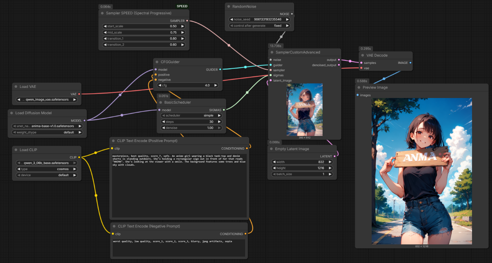

# ComfyUI-SPEED

ComfyUI custom node for **SPEED** — Spectral Progressive Diffusion for faster sampling. Progressively expands the latent resolution during denoising, reducing computation while preserving visual quality.

**Official code:** https://github.com/howardhx/speed

Key references:

- Project page: https://howardxiao.ca/speed/
- Paper (PDF): https://howardxiao.ca/speed/paper/paper.pdf
- arXiv: https://arxiv.org/abs/2605.18736

Workflow:



## Speed comparison (FLUX preset, default parameters)

| SPEED sampler (this node)                                                 | Baseline (euler sampler) |
| ------------------------------------------------------------------------- | ------------------------ |
| `mode=delta_optimal` `model_preset=flux` `scales=0.5,1.0` `delta=0.01` `transform=dct` `base_sampler=euler`<br><br><br><br>**20s**<br>**1.33x faster** | <br><br>**26.5s**<br>**1.00x** |

## Usage

1. Place this folder under your ComfyUI `custom_nodes` directory, then restart ComfyUI.
2. Connect the **Sampler SPEED (Spectral Progressive Diffusion)** output to **SamplerCustomAdvanced**.

## Inputs

| Input | Type | Default | Description |
|---|---|---|---|
| `base_sampler` | combo | `euler` | Underlying ODE solver. Any `comfy.k_diffusion.sampling` sampler supported. |
| `transform` | combo | `dct` | Spectral basis for expansion: `dct` (any ratio), `dwt` (2× only), `fft` (any ratio). |
| `mode` | combo | `delta_optimal` | `delta_optimal` computes transitions from the power-spectrum preset. `manual` uses user-specified sigma thresholds. |
| `model_preset` | combo | `flux` | Power-spectrum preset: `flux`, `wan21`, or `custom` (use `spectrum_A` / `spectrum_beta`). |
| `scales` | string | `0.5,1.0` | Comma-separated resolution fractions ending at `1.0`. e.g. `0.25,0.5,1.0`. |
| `delta` | float | `0.01` | Noise-dominated tolerance (Eq. 9). Smaller values delay transitions. |
| `manual_sigmas` | string | `0.85` | Comma-separated sigma thresholds (one per transition). Used in `manual` mode. |
| `spectrum_A` | float | `203.615` | Power-law amplitude (used when `model_preset=custom`). |
| `spectrum_beta` | float | `1.915` | Power-law decay exponent (used when `model_preset=custom`). |
| `seed` | int | `0` | Seed for spectral-noise padding at each transition. |

### delta_optimal mode (recommended)

Set `model_preset` to `flux` or `wan21` and adjust `scales` and `delta`. Transition timing is computed automatically from the VAE power spectrum using Eq. 9 and Eq. 10 of the paper.

### manual mode

Set `mode=manual` and supply comma-separated sigma thresholds in `manual_sigmas` (one per transition between adjacent scales). Sigma decreases as denoising progresses, so the first threshold should be larger than the last (e.g. `0.95,0.85` for three scales).

## Credits & license

This implementation is based on and derived from the official SPEED repository by Howard Xiao et al.:

- **Official code:** https://github.com/howardhx/speed (BSD 3-Clause)
- **Paper:** Xiao, H., Chao, B., Yariv, L., & Wetzstein, G. (2026). *Spectral Progressive Diffusion for Efficient Image and Video Generation.*

Please see the original project page and repository for full authorship, details, and license information.

## BibTeX

```
@article{xiao2026spectral,
  author    = {Xiao, Howard and Chao, Brian and Yariv, Lior and Wetzstein, Gordon},
  title     = {Spectral Progressive Diffusion for Efficient Image and Video Generation},
  year      = {2026},
}
```
